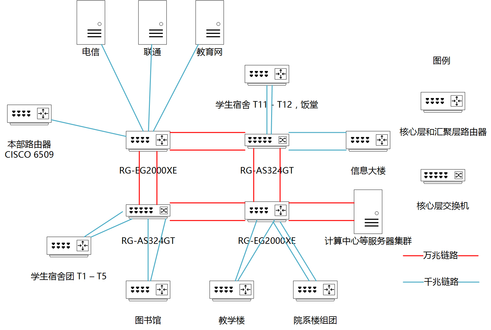
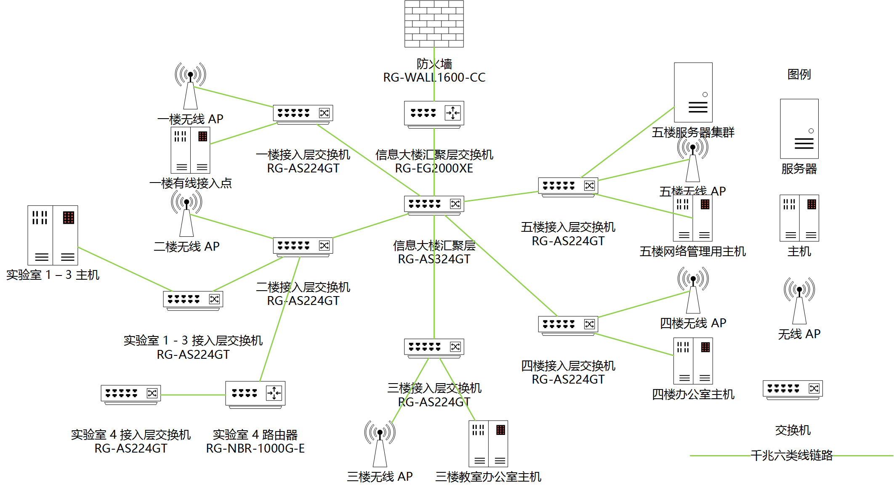

<h1>网络设计报告</h1>

<!-- TOC -->

- [1. Introduction](#1-introduction)
    - [1.1 现状](#11-现状)
    - [1.2 建设的总体目标](#12-建设的总体目标)
    - [1.3 拟开展的功能和应用](#13-拟开展的功能和应用)
- [2. 网络系统结构设计](#2-网络系统结构设计)
    - [2.1 宏观地理分布图](#21-宏观地理分布图)
    - [2.2 拓扑结构图](#22-拓扑结构图)
        - [2.2.1 全校宏观拓扑设计](#221-全校宏观拓扑设计)
        - [2.2.2 信息大楼拓扑设计](#222-信息大楼拓扑设计)
    - [2.3 设备选型](#23-设备选型)
    - [2.4 网络逻辑结构设计](#24-网络逻辑结构设计)
        - [2.4.1 全校宏观设计](#241-全校宏观设计)
        - [2.4.2 信息大楼网络设计概览](#242-信息大楼网络设计概览)
        - [2.4.3 信息大楼一楼](#243-信息大楼一楼)
        - [2.4.4 信息大楼二楼](#244-信息大楼二楼)
        - [2.4.5 信息大楼三楼和四楼](#245-信息大楼三楼和四楼)
        - [2.4.6 信息大楼五楼](#246-信息大楼五楼)
        - [2.4.7 信息大楼网络设计总结](#247-信息大楼网络设计总结)
        - [2.4.8 信息大楼网络安全设计](#248-信息大楼网络安全设计)
- [3. 应用系统设计](#3-应用系统设计)
- [4. 经济可行性分析](#4-经济可行性分析)
- [5. 网络安全性分析](#5-网络安全性分析)
- [6. 网络工程实施：综合布线系统的设计图和进度安排](#6-网络工程实施综合布线系统的设计图和进度安排)
- [7. Reference](#7-reference)

<!-- /TOC -->

## 1. Introduction

### 1.1 现状

当前的南校区建设工作仍在进行，不同楼栋之间的网络设计和建设活动尚未结束。本设计报告着眼于筹备建筑中的信息大楼，从多方面对南校区整体规划和信息大楼网络需求进行了分析，提出了符合实际需求的网络设计方案。

### 1.2 建设的总体目标

通过在校园网内建立各种服务，满足师生，职工和家属等各类人群对网络服务的需求。

### 1.3 拟开展的功能和应用

提供面向所有用户的互联网访问、数据中心、教育网访问和邮箱等基础服务；面向教研人员等的高性能计算服务；面向海外留学生的 VPN 与 VPS 服务等。

## 2. 网络系统结构设计

### 2.1 宏观地理分布图

从地理位置上看，南校区各大需要上网的建筑之间的距离普遍超过双绞线 100 米的最大长度限制，故各楼之间拟统一采用光纤连接。下图中的红色轨迹可以认为是网络干线的铺设通路。

图一 南校区主要上网地点之间的距离

从南校区当前的规划来看，信息大楼最有可能落成的地方在南岸院系楼附近。

### 2.2 拓扑结构图

拓扑结构以星型拓扑为主，从位于图书馆顶层的网络中心向外辐射。同时，在学生宿舍 T1、T12、教学楼、图书馆和院系楼等关键汇聚层节点增加了路由器，以划分子网。

#### 2.2.1 全校宏观拓扑设计

下图着重于南校区的整体设计。

图二 全校整体设计

南校区拓扑设计方案仿照本部现有的成熟方案。核心路由器和交换机采用 2 + 2 的形式，形成链路冗余，增强核心层的可靠性。而在连接各子网方面，本设计方案尽可能地按照预估流量平均分配到四台核心设备上，如两个学生宿舍楼组团分别连接到两台不同的核心交换机上。

在链路速度上，仿照现有方案，给核心层的设备之间设计了双万兆链路，以提高网络的转发速度和可靠性。而核心层和下面各子网之间的链接采用千兆链路。

#### 2.2.2 信息大楼拓扑设计

下图展示信息大楼的网络拓扑设计概览。图中包含汇聚层 - 接入层的拓扑结构。

图三 信息大楼网络拓扑设计概览

信息大楼一共五层，图中按照每一层的顺序依次排列。信息大楼内部实行“千兆到户”的策略，以千兆六类线为载体，构建全千兆网络。

### 2.3 设备选型

设备选型标准参考学校本部现有网络设备情况。

1.  核心层路由器选用锐捷 RG-EG2000XE，每台售价 ￥288000[1]。提供 4 个万兆光口，可用于核心层内部互联。

    核心层交换机选用锐捷 RG-AS324GT 24口千兆三层交换机，每台售价￥3600[2]，并添加适量的 2 端口 SFP + 万兆模块，以提供万兆交换能力。

2.  汇聚层交换机同样选用选用锐捷 RG-AS324GT。此交换机有 SFP 复用功能，可以通过双光纤与核心层交换机互联，以提高网络的可靠性。通过六类线与接入层交换机相连。

    汇聚层路由器与核心层相同，为 RG-EG2000XE。

3.  接入层交换机选用锐捷 RG-AS224GT 24口千兆二层交换机，每台售价￥1999[3]。通过堆叠的方式提供更多端口。通过六类线与接入点相连。

4.  无线网络控制器采用锐捷 RG-AW608，能为约 10000 台无线设备提供接入能力[4]。

### 2.4 网络逻辑结构设计

本节首先介绍全校网络拓扑的宏观设计，然后具体介绍信息大楼的各楼层设计。

#### 2.4.1 全校宏观设计

从所需的 IP 地址数目上看，本校所有上网设备所需要的 IP 地址数量必然超过 B 类私有地址所能提供的最大地址数量。参考目前学校的地址块分布情况，拟在核心层 - 汇聚层采用 A 类私有地址块：10.0.0.0/8 ~ 10.255.255.255/8。然后在汇聚层 - 接入层 - 用户主机中采用 B 类地址块：172.16.0.0/12 ~ 172.31.255.255/12。在接入层以下仍需要建立子网的，由实施单位自行分配 C 类适当的地址块：192.168.0.0/16 ~ 192.168.255.255/16，并设置 NAT，DHCP Snooping 等必要功能。

为了保证网路的容错性，核心层内以及核心层 - 汇聚层交换机之间使用双光纤链接，并开启链路聚合功能；在汇聚层 - 接入层上，采用六类线连接；接入层 - 用户之间采用单六类线连接，以降低成本。

在具体的 IP 分配方案上，指定 IP 地址直至接入层交换机，并在汇聚层的三层交换机开启 DHCP 功能，且指定每一台二层交换机所获得的网段。并在接入层的二层交换机开启 DHCP 中继功能，以解决实际的 IP 地址分配问题。除某些不允许访问互联网的 IP 地址块之外，其余的地址块均做相应的 NAT 设置，以提供互联网访问能力。其他有特殊需求的网段单独设置。

无线网络与有线网络接入同一层的接入层交换机。

路由协议采用 OSPF 协议。

#### 2.4.2 信息大楼网络设计概览

假定信息大楼获得的地址块为：172.16.0.0/21，包含 2048 个 IP 地址。接入层交换机获得的 IP 地址块按楼层指定分配。

信息大楼汇聚层路由器以 10.0.0.2/8 作为本机与核心层交换机连接的 IP 地址，核心层交换机的 IP 地址设置为 10.0.0.1/8。

#### 2.4.3 信息大楼一楼

本层为教室与会议室，共有 10 间。**教室共有 8 间，每间使用者人数假定为 64 人；会议室共有 2 间，使用者假定为每间 256 人**。

图四 信息大楼一楼结构图

1.  有线网络需求分析：每间教室和会议室均有 1 台计算机接入校园网，同时还需预留 2 个网络接入点。故分配 32 个有线网络地址给本层。

2.  无线网络需求分析：考虑到本层会在上课开会时间会有大量人员使用无线设备，故按预想使用者数目的 1：1 配备无线网络 IP 地址，即 1024 个 IP 地址。

考虑到本层有线网络和无线网络所需要的 IP 数差距太大，故让有线网络和无线网络共用一个 10 位地址块。

设备间在会议室与旁边的教室之间。

#### 2.4.4 信息大楼二楼

本层为学生实验室机房。其中一个实验室配置 192.168.X.X 的私有 IP 地址。

图五 信息大楼二楼结构图

1.  有线网络需求分析：共 4 个实验室，每个实验室有 60 台主机。则需要至少 240 个 IP 有线是网络 IP 地址。由于 1 - 4 号实验室均有大量主机需要通过有线网络接入校园网，那么还需要在每一间实验室内，通过堆叠的方式提供一台“64口”的交换机。同时，由于 4 号实验室需要进行计算机网络实验，需要配备 C 类私有 IP 地址，且需要访问互联网，故需要在本教室的接入层交换机和本层的接入层交换机之间增设一台支持 NAT 功能的路由器 RG-NBR-1000G-E。分配 256 个有线网络地址给本层。

2.  无线网络需求分析：由于本层为学生实验室，无线上网的需求依然十分强烈，故分配与有线网络一样多的 IP 地址。

本层有线网络和无线网络共需 512 个 IP 地址，需要分配一个 9 位地址块。

与实验室共用设备间。

#### 2.4.5 信息大楼三楼和四楼

每层共有 20 间办公室，每间办公室提供 2 个接入点。

图六 信息大楼三楼四楼结构图

1.  有线网络需求分析：理论上每层需要提供 40 个有线网络 IP 地址。但考虑到教授们可能会为了方便科研教学活动而通过自备的路由器或交换机接入一些有线设备，故每层分配 64 个有线网络 IP 地址。

2.  无线网络需求分析：保险起见，每层分配同样多的无线网络 IP 地址，即 64 个。

那每层共需 128 个 IP 地址，需要分配一个 8 位地址块。两层合用一个 9 位地址块。

设备间在 4 号和 11 号办公室内。

#### 2.4.6 信息大楼五楼

本层为服务器机房。

图七 信息大楼五楼结构图

1.  有线网络需求分析：初始设计中已计划部署不同类型共 7 台服务器：DNS 服务器 1 台、WWW 服务器 1 台以及其他服务器 5 台。那考虑到以后服务器数量可能会随着学院的发展而不断增加，则共分配 32 个有线网络 IP 地址。同时，本楼的 DHCP 服务器也放置于此。

2.  无线网络需求分析：分配与有线网络同样多的 IP 地址。

那本层共分配 64 个 IP 地址，使用一个 7 位地址块。

另外，每个对外服务器仍有与核心层直连的光纤通路，在此不再赘述。

设备间在服务器机房之间。

#### 2.4.7 信息大楼网络设计总结

通过以上分析，我们给信息大楼分配 2048 个 IP 地址是合适的，那么可以有以下按楼层的详细 IP 地址与网段分配表：

|楼层|功能|预估有线网 IP 使用数|预估无线网 IP 使用|分配 IP 数量|所得网段|所获 IP 地址数目|空余 IP 地址数目|
|---|--|-----------|------------|--|-|-|-|
|一楼|教室与会议室|32|1024|1024|172.16.0.0/22|1024|0|
|二楼|实验室机房|256|256|512|172.16.4.0/23|512|0|
|三楼|教师办公室|64|64|128|172.16.6.0/24|256|128|
|四楼|教师办公室|64|64|128|172.16.7.0/25|128|0|
|五楼|服务器机房|32|32|64|172.16.7.128/25|128|64|

由上表可得，本地址块已分配出去的 IP 地址数目为 1856 个，使用率为 90.625%。

#### 2.4.8 信息大楼网络安全设计

1.  防火墙
    
    信息大楼的防火墙模块选用锐捷 RG-WALL1600-CC，并根据实际情况需求开启所需的安全服务。

2.  VLAN

    为了从逻辑上隔开教师办公网络、教室网络和机房网络等，应该给对应的网络设定 VLAN ID：

    |楼层|作用|VLAN Tag|
    |---|----|-------|
    |一楼|教室和会议室网络|1|
    |二楼|实验室网络|2|
    |三楼|教师办公室网络|3|
    |四楼|教师办公室网络|3|
    |五楼|服务器机房|4|

    而为了能在不同的 VLAN 之间实现相互访问，则需要在信息大楼的三层交换机上做相应设置。

## 3. 应用系统设计

应用系统能提供教育网和互联网的访问、DNS 服务、DHCP 服务、计算中心等教研所需的服务。

在网络出口方面，目前提供了电信、联通和教育网三个出口。每个出口带宽均为 1 G。

## 4. 经济可行性分析

在建立校园网所花费的经费中，网络设备使用了较多的经费。而网络设备材料，如网线等使用了较少的经费。

## 5. 网络安全性分析

在本网络中，采用了增添防火墙和划分 VLAN 两种安全措施。在不遭受针对性攻击的情况下，可保证校园网安全。

## 6. 网络工程实施：综合布线系统的设计图和进度安排

1.  设计图

    考虑到整栋信息大楼结构呈对称分布，且满足千兆以太网线缆长度不能超过 100 米的要求，故设备间设置在大楼每一层的中庭附近。

    

2.  进度安排

    整个信息大楼的综合布线工程拟在 2 个月内完成。第一个月完成强电线路和设备的安装，如空调和风扇等。第二个月完成弱电线路和设备的安装，如网络和电话等的安装。

## 7. Reference

1.  锐捷RG-EG2000XE8个千兆电固化光4万网络安全路由器多业务路由器，https://item.taobao.com/item.htm?spm=a230r.1.14.8.MOGLbx&id=551043770891&ns=1&abbucket=3#detail
2.  锐捷（Ruijie）RG-AS324GT 24口千兆智能安全企业级三层交换机，http://item.jd.com/10925670423.html
3.  锐捷（Ruijie）RG-AS224GT 24口千兆企业级网管智能二层交换机，http://item.jd.com/10924016242.html
4.  锐捷（ruijie）RG-AW608 无线控制器，http://item.jd.com/10899887731.html
