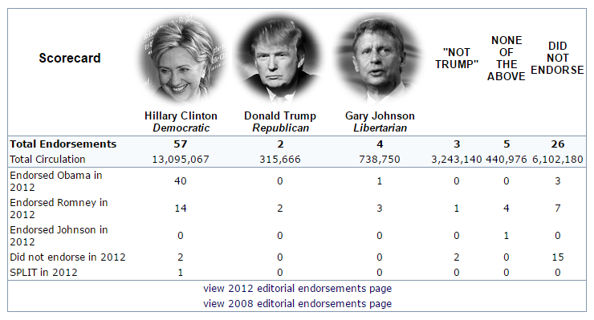
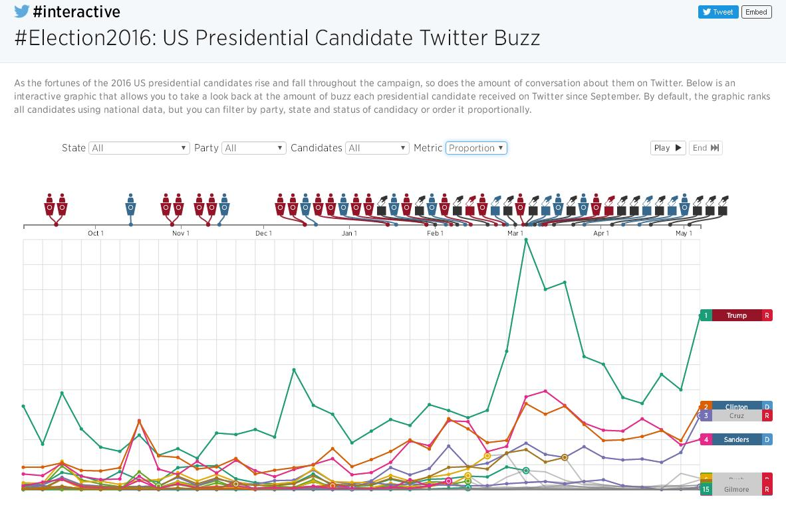

<h1 style="text-align: center">新媒体在 2016 年美国总统大选中的地位与其影响</h1>

stormlin 2017-06-08

**Deadline: Jun. 14**

**摘要：**

*关键词：2016，美国，总统大选，新媒体*

<!-- TOC -->

- [1. 2016 年美国总统大选情况回顾](#1-2016-年美国总统大选情况回顾)
- [2. 通过新媒体进行总统竞选宣传的历史](#2-通过新媒体进行总统竞选宣传的历史)
- [3. 本次总统选举中两类媒体的地位与影响](#3-本次总统选举中两类媒体的地位与影响)
    - [3.1 两类媒体的立场及其决定因素](#31-两类媒体的立场及其决定因素)
    - [3.2 新媒体的兴起以及传统媒体的失效](#32-新媒体的兴起以及传统媒体的失效)
    - [3.3 新媒体对塑造竞选人公众形象的作用](#33-新媒体对塑造竞选人公众形象的作用)
- [4. 新媒体报道的局限性](#4-新媒体报道的局限性)
- [5. 结论](#5-结论)
- [6. 引用](#6-引用)

<!-- /TOC -->

## 1. 2016 年美国总统大选情况回顾

在本次总统选举中，尽管共和党总统候选人唐纳德·特朗普在普选中获得约 630 万票，不敌获得 约 658 万票的民主党候选人克林顿·希拉里。但他在选举人阶段以 304 票战胜获得 227 票的希拉里，成功当选第 45 任美国总统[1]。

直到选举人投票结果公布之前，从华尔街大资产阶级到加州普通高校学生均不看好特朗普，认为他只是一个“搅局者”；在以往的总统选举中发挥了巨大作用的主流媒体也一片唱衰。但为什么特朗普能在最后的选举人阶段击败形势一片大好的希拉里？

从美国宪法来看，普通选民的投票结果并不直接决定下一届美国总统人选，只是起到一个“反映民意”的作用；真正有决定权的各州委派的选举人。而选举人投票的依据标的，就是普选阶段中，在自己选区中获胜的党。故候选人只要赢得选举人阶段的投票，即可当选下一届美国总统。但即便如此，在不出现较多“失信选举人”的情况下，想要获得选举人阶段的胜利，仍需获得较多民众的支持。

抛开两位候选人的实际政纲，本文单单从新媒体的运用与影响这一角度，讨论新媒体对塑造候选人良好形象的作用以及对最终投票结果的影响。

## 2. 通过新媒体进行总统竞选宣传的历史

从某些意义上讲，美国总统选举就是一场声势浩大的媒体秀：谁的媒体支持者更多，谁就能在竞选过程中获得更多的话语权。200 百多年前，林肯只能站在马车上亲自向民众宣传自己的施政纲领。80 年前，罗斯福抓住了广播的大发展的事实，开创性地使用广播来播报自己的“炉边谈话”，以求让自己的政治主张获得更多的支持[2]。10 年前，上任美国总统奥巴马的竞选团队就充分利用了互联网信息“短、平、快”的特点，在党内预选中击败了同为总统候选人的希拉里[3]。

在特定的历史条件之下，运用新媒体进行政治宣传的效果总是格外的好。例如，罗斯福通过“炉边谈话”成功地塑造了自己亲民的形象，为推行改革减少了不少的阻力。而在本次总统选举中，特朗普通过自己独有的“推特治国”的方式，拉近了自己与底层选民的距离，为自己赢得了大量的选票。

## 3. 本次总统选举中两类媒体的地位与影响

在本次选举中，双方竞选团队都使用到了从传统媒体到新兴网络媒体等各种宣传形式。然而，双方的侧重点却大行径庭：希拉里更常用传统媒体，而特朗普则偏好新媒体。显然，希拉里并没有吸取教训。

### 3.1 两类媒体的立场及其决定因素

从传统媒体的代表——纸媒这一角度看，相对于特朗普而言，希拉里的优势真不可谓不少[4]：在本届大选中，有 57 家大型报纸宣布公开支持希拉里；而仅有 2 家报纸宣布支持特朗普。

图一 美国大型报纸对两位候选人的支持情况[5]

造成这种情况的原因，其一是由于希拉里竞选基金的部分金主也是这些主流媒体的实际所有者。那么调动自己名下的媒体来为自己支持的总统候选人加油助威并不算过分。其二是美国媒体固有的政治立场[6]的影响，如 Fox 电视台、《华尔街日报》和《华盛顿时报》等铁杆共和党媒体对上 NBC 等铁杆民主党媒体。

而在新媒体方面，由于其内容的来源为网民，华尔街资本所带来的影响几乎可以忽略。同时，由于时代的发展，在现在几乎人手一台手机的情况下，仍以传统媒体为主要信息来源的人越来越少。而通过这类在线服务平台统计出来的数据其来源相对于传统的纸媒和电视等更加准确。而新媒体公司由于其数据能快速更新，且易于分析的特点，其立场也更不坚定。例如，在分析大量数据之后，Facebook 得出了特朗普的支持率更高的结论，进而果断从支持希拉里转向支持特朗普[7]。

### 3.2 新媒体的兴起以及传统媒体的失效

自互联网在普罗大众中普及开始算起，互联网至今也有将近二十年的历史了。在此期间，诞生了无数完全颠覆我们生活的产品和技术[7]。

|诞生时间|媒体形式|
|-------|-------|
|20 世纪末 21 世纪初|博客|
|1999 年|QQ|
|2001 年|Wikipedia|
|2004 年|Facebook|
|2006 年|Twitter|
|2009 年|新浪微博|
|2011 年|微信|

表中的这些媒体，在他们出现的时候，都曾深刻地改变了我们的生活方式。而政客们也没有忽略这样一种具有巨大潜力的媒体形式。美国“在线政治”网站主编菲尔·诺贝尔称“网络已经成为了如今总统选举的基础”。而 Google 前 CEO 埃里克在 2006 年底也称“能够发挥互联网全部潜力的候选人，将会在下一次总统大选中脱颖而出”[2]。

在 2008 年上任的奥巴马总统显然是仔细听了两位业界人士的意见：着力在 Facebook、Twitter 和 YouTube 等网络社区中培养自己的支持者[8]。最终，他的努力也受到了回报：奥巴马的 MySpace 的账号的粉丝数目超过了 100 万，其他候选人大多在 4 万以下，为他赢得了大量年轻选民的选票。

而到了 2016 年，特朗普本来就是媒体营销的好手：他自己主演的真人秀《学徒》连续 4 个月位居收视率榜首[7]。相比而言，希拉里团队的营销手段则乏善可陈。其结果就是：51% 的推文转发支持特朗普，43% 的推文转发支持希拉里[9]。

但在同期，特朗普在传统媒体的表现可谓惨淡。2016 年 7 月至 10 月，特朗普在 ABC、CBS 和 NBC 三大电视台的黄金时段的报道量远超希拉里，但其中 91% 都是负面内容[4]。同时，美国各大电视台的民意调查也纷纷唱衰特朗普。但最终的结果是：他们都错了，而且错的离谱。

图二 传统媒体的预测结果[10]

图三 基于 Twitter 热度的预测结果[11]

在图二和图三中，传统媒体预测希拉里会以大比分优势战胜特朗普，而基于 Twitter 热度的预测数据则给出了完全相反的结果。但与选举最终结果相符合的，就只有基于 Twitter 的数据。

为什么会出现这样的反差呢？

### 3.3 新媒体对塑造竞选人公众形象的作用

## 4. 新媒体报道的局限性

新媒体并不是万能的。

## 5. 结论

## 6. 引用

1.  Wikipedia，*United States presidential election，*https://en.wikipedia.org/wiki/United_States_presidential_election,_2016
2.  胡 瑛 陈力峰，*从奥巴马当选看新媒体对美国总统大选的渗透*
3.  翟峥，*对 2012 年美国总统大选的政治传播学探讨*
4.  张鸥，*美国大选特朗普媒体组合传播策略浅析*
5.  The American Presidency Project，2016 General Election Editorial Endorsements by Major Newspapers，http://www.presidency.ucsb.edu/data/2016_newspaper_endorsements.php
6.  王润泽，*谈媒体的政党传统在美国大选中延伸*
7.  谭天、李玲，*传统媒体的失效及社会化传播的兴起*
8.  高金萍，*美国大选信息传播的“变”与“不变”*
9.  杨文静，*2016 年美国大选中的媒体竞争分析*
10. FiveThirtyEight.com，https://projects.fivethirtyeight.com/2016-election-forecast/
11. Andrew Hutchinson，http://www.socialmediatoday.com/technology-data/using-social-media-data-predict-2016-us-presidential-election?utm_source=tuicool&utm_medium=referral
